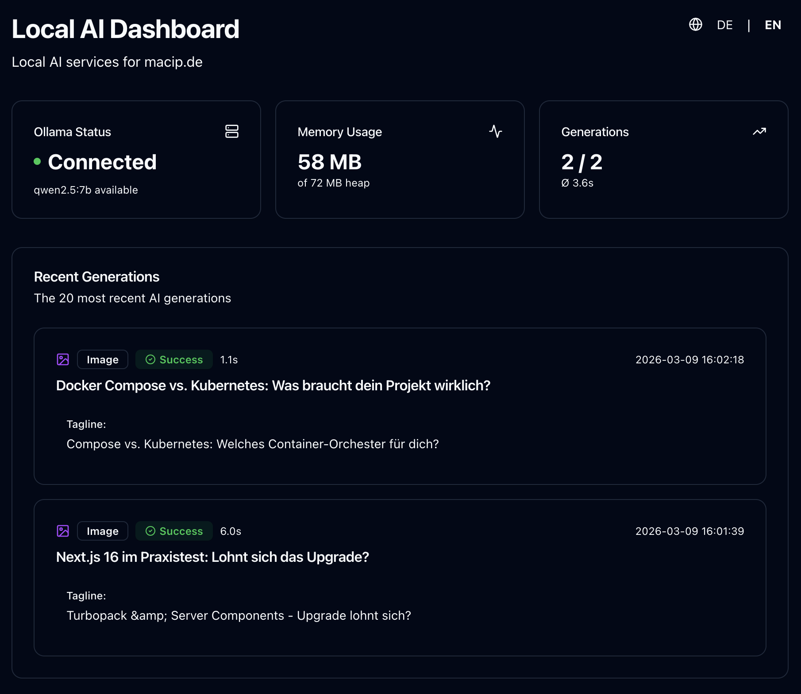

<div align="center">

# 🤖 Local AI

**Self-hosted AI content generation service powered by Ollama**

[](https://nextjs.org/)
[](https://www.typescriptlang.org/)
[](https://ollama.ai/)
[](https://ui.shadcn.com/)
[](LICENSE)

[Features](#-features) • [Quick Start](#-quick-start) • [API](#-api-reference) • [Architecture](#-architecture) • [Contributing](#-contributing)



</div>

---

## 🎯 Overview

Local AI is a self-hosted, multilingual content generation service that runs on your local machine, providing AI-powered Twitter thread generation and OG image creation for blog posts. Built with Next.js and powered by Ollama's qwen2.5:7b model, it offers a beautiful dashboard with language switching (German/English) to monitor generations and system status.

### Why Local AI?

- 🔒 **Privacy-first**: Your content never leaves your machine
- ⚡ **Fast**: Local inference with automatic model loading/unloading
- 📊 **Transparent**: Full generation history and performance metrics
- 🎨 **Beautiful**: Modern UI with shadcn/ui v4 and Tailwind CSS v4
- 🔧 **Production-ready**: PM2 process management with automatic builds

## ✨ Features

- 🤖 **AI Tweet Generation**: Create engaging Twitter threads from blog content
- 🖼️ **OG Image Generation**: AI-powered taglines for social media cards (1200×630)
- 🌍 **Multilingual Support**: German & English language support for both dashboard and API
- 📊 **Real-time Dashboard**: Monitor Ollama status, RAM usage, and generation history
- 💾 **SQLite Logging**: Complete history of all generations with performance metrics
- 🔄 **Auto-scaling**: Model automatically loads/unloads based on usage
- 🚀 **Zero-config Deployment**: Automated build process with portable paths
- 🎨 **Modern UI**: Built with shadcn/ui components and dark mode

## 🚀 Quick Start

### Prerequisites

- Node.js 22+
- [Ollama](https://ollama.ai/) installed and running
- macOS, Linux, or Windows WSL

### Installation

```bash
# 1. Clone the repository
git clone https://github.com/utfcmac/local-ai.git
cd local-ai

# 2. Install dependencies (automatically sets up Git hooks)
npm install

# 3. Pull the Ollama model
ollama pull qwen2.5:7b

# 4. Start Ollama as a daemon
brew services start ollama  # macOS
# OR
systemctl start ollama      # Linux

# 5. Configure API key (see Configuration section below for details)
# Generate a secure key: openssl rand -hex 32
echo 'LOCAL_AI_API_KEY=your-secret-key-here' > .env.local

# 6. Build the application
npm run build

# 7. Start with PM2 (loads env vars first!)
set -a && source .env.local && set +a
npm run pm2:start
pm2 save
```

The dashboard will be available at:
- German (default): `http://localhost:3100/` or `http://localhost:3100/de`
- English: `http://localhost:3100/en`

Use the language switcher in the top-right corner to toggle between languages.

> **💡 Important:** The `LOCAL_AI_API_KEY` must match the key configured in your external systems (e.g., blog platform). See the [Configuration](#-configuration) section for detailed setup instructions.

### Development Mode

```bash
npm run dev
```

## 📡 API Reference

### Health Check

```bash
GET /api/health
```

No authentication required. Returns system and Ollama status.

**Response:**
```json
{
  "status": "ok",
  "ollamaRunning": true,
  "modelAvailable": true,
  "modelLoaded": false,
  "models": ["qwen2.5:7b"],
  "stats": {
    "total": 42,
    "success": 40,
    "error": 2,
    "avgDurationMs": 8500
  },
  "systemMemory": {
    "totalGb": 36,
    "freeGb": 12,
    "usedGb": 24
  }
}
```

### Generate Twitter Thread

```bash
POST /api/generate
Content-Type: application/json
x-api-key: your-secret-key
```

**Request:**
```json
{
  "title": "My Blog Post Title",
  "excerpt": "A brief description",
  "content": "Full MDX content of your blog post...",
  "blogUrl": "https://example.com/blog/my-post",
  "blogPostId": "optional-uuid",
  "language": "de"
}
```

**Parameters:**
- `language` (optional): `"de"` or `"en"` - Generates prompts in specified language (default: `"de"`)

**Response:**
```json
{
  "success": true,
  "mainTweet": "Engaging main tweet (max 280 chars)",
  "replyTweet": "Follow-up thought (max 255 chars)",
  "durationMs": 7500,
  "model": "qwen2.5:7b"
}
```

### Generate OG Image

```bash
POST /api/generate-image
Content-Type: application/json
x-api-key: your-secret-key
```

**Request:**
```json
{
  "title": "My Blog Post Title",
  "excerpt": "A brief description",
  "content": "Full MDX content...",
  "blogPostId": "optional-uuid",
  "language": "en"
}
```

**Parameters:**
- `language` (optional): `"de"` or `"en"` - Generates tagline in specified language (default: `"de"`)

**Response:** PNG image (1200×630) with AI-generated tagline

## 🏗️ Architecture

```
┌─────────────────────┐         ┌──────────────────────┐
│   Blog Platform     │         │   Local AI (Port 3100) │
│                     │◄─HTTP──►│                        │
│  ┌──────────────┐   │         │  ┌─────────────────┐  │
│  │ Content API  │───┼────────►│  │ /api/generate   │  │
│  └──────────────┘   │         │  └─────────────────┘  │
│                     │         │                        │
│  ┌──────────────┐   │         │  ┌─────────────────┐  │
│  │ OG Images    │───┼────────►│  │ /api/generate-  │  │
│  └──────────────┘   │         │  │     image       │  │
│                     │         │  └─────────────────┘  │
└─────────────────────┘         │                        │
                                │  ┌─────────────────┐  │
                                │  │ Ollama :11434   │  │
                                │  │ qwen2.5:7b      │  │
                                │  └─────────────────┘  │
                                │                        │
                                │  ┌─────────────────┐  │
                                │  │ SQLite DB       │  │
                                │  │ (History)       │  │
                                │  └─────────────────┘  │
                                └──────────────────────┘
```

### Technology Stack

| Category | Technology |
|----------|-----------|
| Framework | [Next.js 16](https://nextjs.org/) (App Router, Turbopack) |
| Language | [TypeScript 5.7](https://www.typescriptlang.org/) |
| UI Library | [shadcn/ui v4](https://ui.shadcn.com/) |
| Styling | [Tailwind CSS v4](https://tailwindcss.com/) |
| Internationalization | [next-intl](https://next-intl.dev/) |
| LLM | [Ollama](https://ollama.ai/) (qwen2.5:7b) |
| Database | [SQLite](https://www.sqlite.org/) (better-sqlite3) |
| Process Manager | [PM2](https://pm2.keymetrics.io/) |
| Icons | [Lucide React](https://lucide.dev/) |

## 📦 Build System

The build process is fully automated and portable across different machines:

### Automated Build Pipeline

When you run `npm run build`:

1. **Next.js Build** - Creates optimized production bundle
2. **Post-build Script** - Automatically copies:
   - Static assets (`.next/static`) to standalone build
   - Public files to standalone build
   - Native modules (better-sqlite3) to standalone build
3. **Dynamic Path Resolution** - All paths are resolved at build time from `.next/required-server-files.json`

### Zero-config Deployment

```bash
# Works on any machine, any path!
git clone <repo> /any/path/you/want
npm install
npm run build    # Fully automated
npm run pm2:start
```

**No hardcoded paths** - the build system automatically detects and configures all paths.

## 🛠️ NPM Scripts

```bash
# Development
npm run dev                # Start dev server (port 3100)

# Production
npm run build              # Build with automatic asset copying
npm run start              # Start Next.js server
npm run start:standalone   # Start standalone server directly

# PM2 Management
npm run pm2:start          # Start PM2 process
npm run pm2:restart        # Restart PM2 process
npm run pm2:stop           # Stop PM2 process
npm run pm2:logs           # View PM2 logs
```

## 📊 Dashboard

Access the dashboard at `http://localhost:3100` (German) or `http://localhost:3100/en` (English) to view:

- **Language Switcher**: Toggle between German (DE) and English (EN) in the top-right corner
- **Ollama Status**: Running/stopped, model loaded/available
- **System Metrics**: RAM usage (total/free/used)
- **Generation Stats**: Success rate, error rate, average duration
- **History**: Last 20 generations with details and status

All dashboard text automatically updates when switching languages, including status messages, labels, and descriptions.

## 💾 Database Schema

All generations are logged in `data/generations.db`:

```sql
CREATE TABLE generations (
  id INTEGER PRIMARY KEY AUTOINCREMENT,
  blog_post_id TEXT,
  title TEXT NOT NULL,
  type TEXT NOT NULL DEFAULT 'teaser',  -- 'teaser' or 'image'
  main_tweet TEXT,
  reply_tweet TEXT,
  tagline TEXT,
  model TEXT NOT NULL DEFAULT 'qwen2.5:7b',
  duration_ms INTEGER,
  status TEXT NOT NULL DEFAULT 'pending',  -- 'pending', 'success', 'error'
  error TEXT,
  created_at TEXT NOT NULL DEFAULT (datetime('now', 'localtime'))
);
```

## 🔧 Configuration

### Environment Variables

Create a `.env.local` file:

```env
# Required: API key for authentication
# This is YOUR secret key - external systems must send this in the x-api-key header
# Choose a strong, random string (e.g., openssl rand -hex 32)
LOCAL_AI_API_KEY=your-secret-key-here

# Optional: Custom data directory
LOCAL_AI_DATA_DIR=/path/to/data
```

### API Key Setup

The `LOCAL_AI_API_KEY` is your **server-side secret** that protects the API endpoints:

1. **Generate a secure key:**
   ```bash
   openssl rand -hex 32
   # Example output: a1b2c3d4e5f6g7h8i9j0k1l2m3n4o5p6...
   ```

2. **Set it locally** (`.env.local`):
   ```env
   LOCAL_AI_API_KEY=a1b2c3d4e5f6g7h8i9j0k1l2m3n4o5p6
   ```

3. **External systems must send it** in requests:
   ```bash
   curl -X POST http://your-server:3100/api/generate \
     -H "x-api-key: a1b2c3d4e5f6g7h8i9j0k1l2m3n4o5p6" \
     -H "Content-Type: application/json" \
     -d '{"title": "...", "content": "..."}'
   ```

4. **Same key on both sides:**
   - Your blog platform needs the **same key** configured
   - Without the correct key in the header, requests will be rejected with `401 Unauthorized`

### PM2 Configuration

The `ecosystem.config.cjs` is fully dynamic and portable:

```javascript
// Automatically detects paths from Next.js build
const serverConfig = require('./.next/required-server-files.json');
// No hardcoded paths!
```

**Important:** PM2 needs access to environment variables. Make sure to load `.env.local` before starting:

```bash
set -a && source .env.local && set +a
npm run pm2:start
```

## 🔒 Security

### Authentication

- **`/api/generate`** - Requires valid `x-api-key` header
- **`/api/generate-image`** - Requires valid `x-api-key` header
- **`/api/health`** - Public (no authentication) - read-only system status

### Best Practices

- Generate a **strong, random API key** (minimum 32 characters)
- **Never commit** `.env.local` to version control (already in `.gitignore`)
- Use the **same key** on your blog platform and Local AI instance
- Consider using **HTTPS** if exposing to the internet (e.g., with reverse proxy)
- Run on **trusted networks** only (LAN or VPN)

### Data Privacy

- All processing happens **locally** - no data sent to external services
- SQLite database stored in local `data/` directory
- Full control over your content and generation history

## 📝 Project Structure

```
local-ai/
├── src/
│   ├── app/
│   │   ├── [locale]/
│   │   │   ├── page.tsx          # Dashboard (i18n)
│   │   │   └── layout.tsx        # Locale layout
│   │   ├── layout.tsx            # Root layout
│   │   ├── globals.css           # Tailwind v4 + shadcn theme
│   │   └── api/
│   │       ├── health/route.ts
│   │       ├── generate/route.ts
│   │       └── generate-image/route.tsx
│   ├── components/
│   │   ├── ui/                   # shadcn/ui components
│   │   └── LanguageSwitcher.tsx  # DE/EN toggle
│   ├── lib/
│   │   ├── auth.ts               # API key validation
│   │   ├── db.ts                 # SQLite client
│   │   ├── ollama.ts             # Ollama API wrapper (i18n prompts)
│   │   └── utils.ts              # Utilities
│   ├── messages/
│   │   ├── de.json               # German translations
│   │   └── en.json               # English translations
│   ├── i18n.ts                   # next-intl config
│   └── middleware.ts             # i18n routing
├── scripts/
│   ├── postbuild.js              # Automated build copying
│   └── start-standalone.js       # Dynamic server starter
├── data/
│   └── generations.db            # SQLite database
├── docs/
│   └── dashboard-screenshot.png  # README screenshot
├── package.json
├── next.config.ts
├── tailwind.config.ts
├── components.json               # shadcn/ui config
└── ecosystem.config.cjs          # PM2 config (dynamic)
```

## 🤝 Contributing

Contributions are welcome! Please feel free to submit a Pull Request.

### For Human Contributors

1. Fork the repository
2. Create your feature branch (`git checkout -b feature/amazing-feature`)
3. Follow the [Conventional Commits](https://www.conventionalcommits.org/) format
4. Update `CHANGELOG.md` under `[Unreleased]`
5. Push to the branch (`git push origin feature/amazing-feature`)
6. Open a Pull Request

See [CONTRIBUTING.md](CONTRIBUTING.md) for detailed guidelines.

### For AI Coding Assistants

If you're an AI agent (Claude Code, Cursor, GitHub Copilot, etc.), please read:
- **[AI_DEVELOPMENT.md](AI_DEVELOPMENT.md)** - Complete workflow guide
- **[.clinerules](.clinerules)** - Project-specific rules

**Quick checklist:**
- Use conventional commit messages
- Update `CHANGELOG.md` with every change
- Add i18n for all UI text (de.json + en.json)
- Test build before pushing
- Respond to git hook prompts appropriately

## 📄 License

This project is licensed under the MIT License - see the [LICENSE](LICENSE) file for details.

**TL;DR:** You can do whatever you want with this code! Use it, modify it, distribute it, even commercially. No restrictions.

## 🙏 Acknowledgments

- [Ollama](https://ollama.ai/) - Local LLM runtime
- [shadcn/ui](https://ui.shadcn.com/) - Beautiful UI components
- [Next.js](https://nextjs.org/) - React framework
- [Tailwind CSS](https://tailwindcss.com/) - Utility-first CSS

---

<div align="center">

Made with ❤️ for local AI inference

[Report Bug](https://github.com/utfcmac/local-ai/issues) • [Request Feature](https://github.com/utfcmac/local-ai/issues)

</div>
